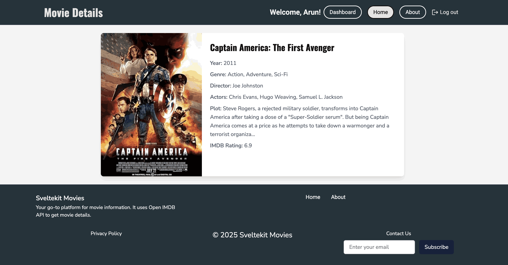
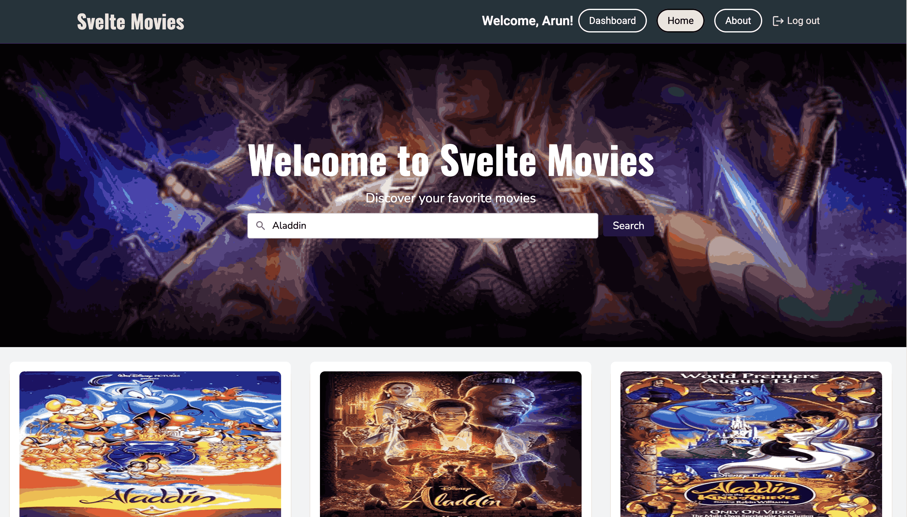

# SvelteKit IMDB 

[](https://kit.svelte.dev/)
[](https://tailwindcss.com/)
[](https://www.docker.com/)
[](https://nginx.org/)
[](https://vitejs.dev/)


Another Svelte app I worked on recently. This app uses OMDB API to get movie data. You can search for movies and view details like plot, year of release, actors, critic score, box office collection and more. Back-end APIs are also written in Svelte using MongoDB as database and Mongoose.

## Screenshots

Let's jump straight into screenshot to see how it looks like first :) 




## Features

- Search for movies by title using the OMDB API.
- View detailed information about a movie, including plot, release year, actors, critic scores, and box office collection.
- Create and manage personalized playlists of your favorite movies.
- Responsive design for seamless usage across devices.
- Backend APIs built with Svelte and MongoDB for efficient data handling.
- Dockerized setup for easy deployment and scalability.
- Optimized performance with Vite and Tailwind CSS integration.
- Nginx support for serving the application in production.

## Development

You can run this by installing npm packages on your system. Make sure you have MongoDB running on your system. Create an env file with the following contents

```
DB_URI=mongodb://localhost:27017/svelte_imdb
JWT_SECRET=somesupersecret
NEXT_PUBLIC_API_BASE_URL=http://localhost:3000
NEXT_PUBLIC_API_KEY=your_api_key_here
```

You can get the API key from this website https://www.omdbapi.com

## Issues

- Not able to read env variables on front-end
- Authentication not working properly


